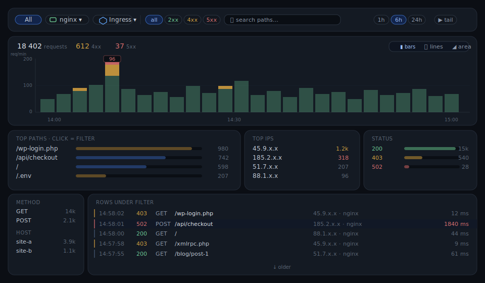

# SOC Dashboard

Self-hosted, AI-assisted SOC for **nginx / ingress-nginx** traffic. Ships logs into Loki,
surfaces attacks and anomalies, and **applies IP/path bans to Cloudflare, plain nginx, or
Kubernetes ingress-nginx** — one central collector plus a one-line agent per nginx VM.

Think *Datadog for nginx bans*. Bilingual UI (EN default, one-click RU), configurable from
the dashboard with ENV as the defaults underneath.



## Features

- **Click-driven log explorer** — pick sources (nginx VMs / ingress), read traffic with 4xx/5xx overlaid, filter by clicking any path / IP / status. No query language. *(shown above)*
- **Grouped multi-target enforcement** — Cloudflare (IP list + WAF) · plain nginx · ingress-nginx, routed per ban by target group; per-target failures isolated + auto-resynced.
- **Auto-ban engine** — rules by path / regex / signature-family / request-rate / country (GeoIP), with a dry-run preview before you arm it.
- **403 path rules** — block scanner paths (`/.env`, `/wp-login`, …) at the nginx/ingress layer.
- **Threat-intel feeds** — import Spamhaus / Tor / custom IP-CIDR lists (self-syncing via TTL).
- **WAF/CRS panel** — per-IP OWASP ModSecurity offenders with one-click ban.
- **IP intelligence** — GeoIP, ASN/org, datacenter/VPN/Tor reputation.
- **LLM analyst** — plain-language insight + robust (MAD/z-score) anomaly detection; global on/off.
- **Notifications** — Slack / Telegram with per-event × severity routing.

```
 nginx VM(s)                     central VM
┌──────────────────┐          ┌──────────────────────────────────────┐
│ nginx + promtail │─ logs ──►│ Loki → soc-backend (dashboard/metrics)│
│ soc-nginx-agent  │─ enroll ►│ blocklist-api (ban orchestrator) ─────┼─► Cloudflare API
│  ▲ pulls denylist│◄ snippet ┤                                       └─► ingress-nginx CM
└──────────────────┘          └──────────────────────────────────────┘
```

Same code runs on **plain VMs** (file/sqlite store, local nginx and/or Cloudflare) and in
**Kubernetes** (ConfigMap store, ingress-nginx enforcement). Enable only the pieces you need.

## Deploy

**Central VM** — Loki + dashboard + ban orchestrator:

```bash
git clone <this-repo> soc && cd soc/deploy
cp .env.example .env && $EDITOR .env      # set BASIC_AUTH_*, BLOCKLIST_TOKEN, PUBLIC_URL
cd compose && docker compose --profile loki --profile soc --profile blocklist up -d
```

Open `http://CENTRAL:8077`.

**Each nginx VM** — in the dashboard, **Resources → add node** and run the one-liner it shows
(agent self-enrolls, gets its own scoped token, ships logs, applies bans). For a fleet, use
[`deploy/inventory-deploy.sh`](deploy/inventory-deploy.sh).

### Variations

| Topology | Set |
|---|---|
| Ban in **Cloudflare**, logs from VMs | `STORE=sqlite`; add a `cloudflare` target (token in Settings); Promtail on each VM |
| Ban in **local nginx** per VM | enroll nodes → auto-promoted to `nginx-file` targets; agent renders + reloads nginx |
| **Kubernetes** ingress-nginx | `STORE=configmap`, `ENFORCE=ingress-cm`; bans render into the controller ConfigMap |
| Read an **existing Loki**, ban in CF | point `LOKI_URL` at your Loki, skip Promtail; one `cloudflare` target |
| **Several at once** | define multiple `BAN_TARGETS`, route with **groups** |

Config is **hybrid**: ENV seeds defaults; the dashboard (**Settings**) overrides at runtime and
persists — no redeploy. `CONFIG_LOCK=env` freezes the GUI to make ENV the single source of truth.

Full guide (Docker profiles · bare systemd · Kubernetes · mixing) and every variable:
**[`deploy/README.md`](deploy/README.md)** · **[`deploy/.env.example`](deploy/.env.example)**.

## Components

`promtail` (tail → Loki) · **soc-backend** (`backend/`: Loki aggregation, LLM insight, dashboard,
`/metrics`, auto-ban executor) · **blocklist-api** (`blocklist-api/`: ban orchestrator + node
registry) · **soc-nginx-agent** (`deploy/agent/`: enroll, heartbeat, pull denylist, reload nginx).

## Security

- Set `BLOCKLIST_TOKEN` + `BASIC_AUTH_*` — with no token the API is unauthenticated (loud startup warning).
- The agent installer runs as root; it refuses non-HTTPS unless `INSECURE=1`. Use `PUBLIC_URL=https://…` across untrusted networks.
- GUI-entered secrets (e.g. the Cloudflare token) are stored in the `STORE` backend in plaintext. On k8s `STORE=configmap` that's a ConfigMap, not a Secret — prefer the CF token via ENV + `CONFIG_LOCK=env`.

## License

[MIT](LICENSE) © 2026 panroman14.
